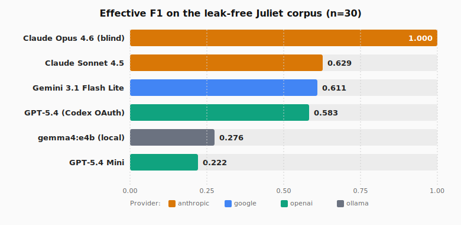

# Agent-G

[](LICENSE)
[](https://python.org)
[](#testing)

**Headless binary-analysis agent** — point it at a binary, pick an LLM, get a vulnerability verdict with full audit trail. No GUI, no manual reversing.

Works with **Claude, Gemini, GPT-5, local Ollama models**, or anything OpenAI-compatible.

---

## Quick start (bare-metal, 4 commands)

Prerequisites: **Python 3.10+**, **Java JDK 17+**, **Ghidra 12.0.2** ([download](https://github.com/NationalSecurityAgency/ghidra/releases)).

```bash
git clone https://github.com/ezrealenoch/Agent-G.git && cd Agent-G
pip install -e .
cp .env.example .env          # edit: set GHIDRA_INSTALL_DIR + one LLM provider
agent-g doctor                # verify everything works
```

Then scan a binary:

```bash
agent-g analyze /path/to/binary
```

Or start an interactive investigation:

```bash
agent-g chat /path/to/binary
```

That's it. `agent-g doctor` tells you exactly what's missing if anything is wrong.

---

## Quick start (Docker, 5 commands)

Prerequisites: **Python 3.10+**, **Docker 24+** with `compose v2`. No Java or Ghidra install needed.

```bash
git clone https://github.com/ezrealenoch/Agent-G.git && cd Agent-G
pip install -e .
cp .env.example .env          # edit: set one LLM provider

# Start the Ghidra sandbox
docker compose -f sandbox/docker-compose.yml up --build -d

# Point CLI at the sandbox
echo -e "AGENT_G_MODE=docker\nGHIDRA_BASE_URL=http://localhost:18080" >> .env
agent-g doctor                # verify everything works
```

Then `agent-g analyze /path/to/binary` or `agent-g chat /path/to/binary` as above.

---

## Quick start (Claude Code as the driver, recommended for serious work)

The `analyze` and `chat` modes above use a third-party LLM (Claude/GPT/Gemini/Ollama) as the
driver inside Agent-G's process. Agent-G also ships a **direct-driver mode**: a Claude Code
session calls Ghidra's HTTP API itself via curl, with Agent-G acting as the sandbox manager
only — no internal LLM, no API key, no `.env` configuration.

This is the mode that produced credible results on real CVEs in our benchmark runs. The
internal-LLM mode hallucinates decompile output on small models under verdict pressure;
driving Ghidra from Claude Code makes hallucination structurally impossible because every
claim must be backed by a real `g.sh` invocation in the bash transcript.

```bash
git clone https://github.com/ezrealenoch/Agent-G.git && cd Agent-G
./install.sh        # Linux / macOS
.\install.ps1       # Windows PowerShell
```

The installer does `pip install -e .`, links `skills/agent-g/` into `~/.claude/skills/agent-g/`,
and persists `AGENT_G_HOME` so the helper scripts always know where the repo lives. Restart
Claude Code afterwards.

Now in Claude Code, just say something like:

> *"investigate `C:\path\to\some-binary.exe`"*
> *"find vulns in `/usr/local/bin/<some-daemon>`"*
> *"decompile this DLL and tell me what it does"*

The skill triggers automatically. Claude Code spawns the Ghidra provisioner, waits for ingest,
queries the HTTP API via `g.sh`, writes a per-binary investigation log, and tears down when
done. You get a fully audited transcript — every quoted decompile is paired with the bash
invocation that produced it.

For a fresh-clone-to-running pipeline (paste this into Claude Code on a new machine):

> *"clone https://github.com/ezrealenoch/Agent-G.git, install it for me, and then run it on `<binary path>`"*

Claude Code will do the full bootstrap in one turn, no further input required.

---

## When to use which mode

| Use case | Mode |
|---|---|
| Interactive investigation, want full audit trail of every Ghidra query | **Claude Code as driver** (the skill) |
| Vuln-hunt with the strongest available reasoning model | **Claude Code as driver** |
| Batch / CI / unattended scanning of many binaries | `agent-g analyze` |
| Benchmarking a specific LLM provider on Juliet | `agent-g analyze --model <name>` |
| Need the structured `provenance.json` audit bundle | `agent-g analyze` |
| Need conversational state across multiple binaries | `agent-g chat` |

The two modes share the same Ghidra pool, the same HTTP API, and the same security model. They
differ only in who's holding the prompt loop: Claude Code in your terminal, vs. an LLM API call
inside Agent-G's process.

---

## How it works

```
You                    Agent-G CLI              Ghidra sandbox
 |                         |                         |
 |  agent-g analyze foo    |                         |
 |------------------------>|  spin up Ghidra pool     |
 |                         |------------------------>|
 |                         |  send prompt to LLM      |
 |                         |---> Claude / GPT / ...   |
 |                         |                          |
 |                         |  LLM calls tools:        |
 |                         |  decompile, xrefs, ...   |
 |                         |<------------------------>|
 |                         |  ... (ReAct loop) ...    |
 |                         |                          |
 |  verdict: VULNERABLE    |                          |
 |<------------------------|  write trace + provenance|
```

1. **Spin up** a sandboxed Ghidra instance (Docker or bare-metal pool)
2. **LLM investigates** the binary through a ReAct tool-calling loop — decompiling functions, tracing xrefs, reading strings, chasing data flow
3. **Produce** a verdict (`VULNERABLE` / `NOT_VULNERABLE` / `UNKNOWN`) + structured report + signed provenance bundle

---

## Commands

```
agent-g version              Print the installed version
agent-g doctor               Self-check: JDK, Ghidra, deps, LLM config
agent-g analyze <binary>     One-shot vulnerability scan (batch mode)
agent-g chat <binary>        Interactive multi-turn investigation (REPL)
agent-g replay <trace>       Inspect a captured trace
agent-g pool status          Show the Ghidra instance pool
agent-g store recent         List recent investigations
```

Run `agent-g <command> --help` for all flags.

### `analyze` vs `chat`

| | `analyze` | `chat` |
|---|---|---|
| **Mode** | Batch — run once, get a verdict | Interactive — multi-turn REPL |
| **Use case** | CI pipelines, bulk scanning, benchmarks | Deep dives, follow-up questions, exploratory RE |
| **Budget defaults** | 10 min / 200K tokens / 80 tools / $1 | 1 hr / 1M tokens / 500 tools / $5 |
| **Output** | Verdict + provenance bundle | Conversation + trace |
| **REPL commands** | n/a | `/help` `/reset` `/budget` `/exit` |

---

## Configuration

All configuration lives in `.env`. Copy [`.env.example`](.env.example),
uncomment one LLM provider section, and paste your API key. That's it.

If you're on Docker, also uncomment the two Docker lines (`AGENT_G_MODE` + `GHIDRA_BASE_URL`).
If you're on bare-metal, uncomment and set `GHIDRA_INSTALL_DIR`.

---

## What you get back

Every run writes a full audit trail to `runs/<trace_id>/`:

```
runs/abc123def456/
  trace.jsonl       Every LLM call + tool call (replayable)
  checkpoint.json   Crash-resume snapshot
  events.jsonl      Runtime event stream
  provenance.json   Binary hash, model, prompt, verdict (signable)
```

Query prior investigations:

```bash
agent-g store recent --limit 10
agent-g store get --trace-id abc123def456
```

---

## Benchmark results

We evaluated Agent-G on a **leak-free Juliet benchmark** — 30 binaries
across 10 CWE categories with fully anonymized symbols, redacted
scaffolding, and hashed filenames. Every verdict comes from actual
data-flow analysis, not pattern-matching on symbol names.



| # | Model | Provider | Eff F1 | Coverage | TP/TN/FP/FN | UNK / BLANK |
|---|---|---|---|---|---|---|
| 1 | **Claude Opus 4.6** (blind) | Anthropic | **1.000** | 30/30 | 15 / 15 / 0 / 0 | 0 / 0 |
| 2 | Claude Sonnet 4.5 | Anthropic | 0.629 | 29/30 | 11 / 6 / 8 / 4 | 1 / 0 |
| 3 | Gemini 3.1 Flash Lite | Google | 0.611 | 26/30 | 11 / 5 / 8 / 2 | 2 / 2 |
| 4 | GPT-5.4 (Codex OAuth) | OpenAI | 0.583 | 27/30 | 7 / 13 / 1 / 6 | 3 / 0 |
| 5 | gemma4:e4b (local) | Ollama | 0.276 | 12/30 | 4 / 5 / 0 / 3 | 0 / 18 |
| 6 | GPT-5.4 Mini | OpenAI | 0.222 | 29/30 | 2 / 14 / 0 / 13 | 1 / 0 |

**"Effective F1"** counts any `UNKNOWN` or `BLANK` response as a wrong
answer — no free passes for indecision.

### What we learned

- **Only Claude Opus 4.6 actually solves this corpus** (30/30 clean).
  Every other model faces the standard precision/recall trade-off.
- **Gemini Flash Lite and Claude Sonnet 4.5 are "aggressive"** — high
  recall on real bugs, high false-positive rate on safe variants.
- **GPT-5.4 and GPT-5.4 Mini are "conservative"** — near-perfect
  precision but they miss most real vulnerabilities, especially Mini
  which committed to `NOT_VULNERABLE` on 13 of 15 bad binaries.
- **gemma4:e4b struggles with commitment, not reasoning.** When it
  commits to a verdict (12/30 cases) its raw F1 is 0.727. The problem
  is the other 18 binaries where the small model goes blank.
- **GPT-5.4 Mini is pathologically cautious on security tasks.**
  Precision 1.000 but recall 0.133 — the wrong trade-off for a
  vulnerability audit.

Full report with per-CWE heatmap, verdict matrix, and model
compatibility notes:
[`logs/juliet_comparison_report.html`](logs/juliet_comparison_report.html).

---

## Testing

```bash
pip install -e '.[dev]'
pytest tests/ -v
```

20 regression tests covering the ReAct loop, budget enforcement,
trace replay, tool schema validation, and prompt library.

---

## Architecture

`src/runtime/` is where the production pieces live:

| Module | Purpose |
|---|---|
| `conversation.py` | ReAct loop with budget + checkpoint + trace wiring |
| `circuit_breaker.py` | Per-provider circuit breaker with backoff and HALF_OPEN probe |
| `budget.py` | Hard caps on wall-time, tokens, tool calls, cost |
| `checkpoint.py` | Atomic JSON checkpoints for crash-resume |
| `trace.py` | Append-only JSONL trace + replay + provenance bundle |
| `ghidra_pool.py` | Stateless pool manager for concurrent investigations |
| `result_store.py` | SQLite store for querying prior runs |
| `prompt_library.py` | Versioned prompts with content hashes |
| `tool_schema.py` | Strict validation of LLM tool calls |
| `observability.py` | Structured JSON logs + trace-id propagation |
| `secrets.py` | Pluggable secrets chain (env / winvault / vault / awssm) |

`sandbox/` holds the Docker image. `tests/` holds the regression suite.

---

## License

MIT — see [LICENSE](LICENSE).
